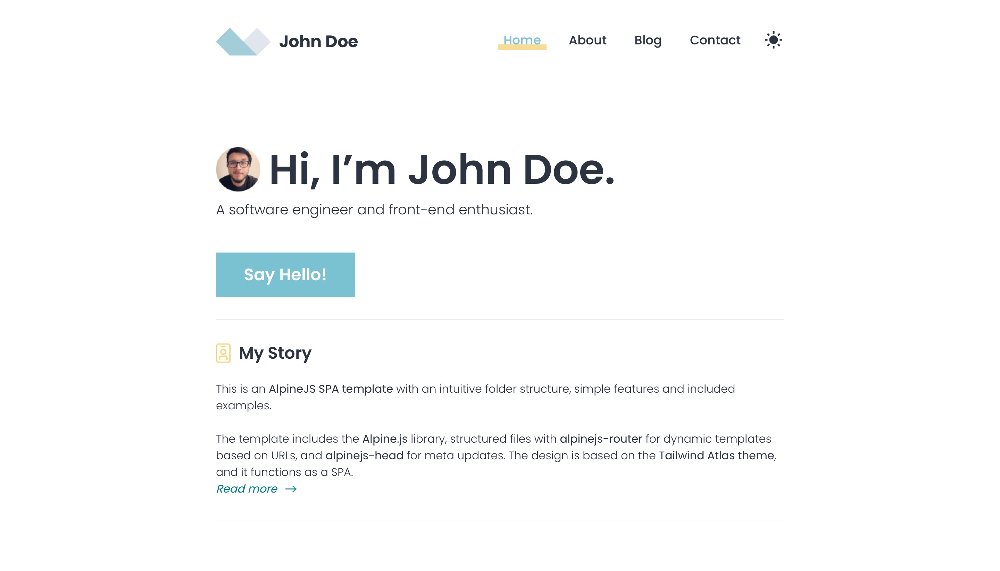

# AlpineJS SPA template

This is an **[AlpineJS SPA template](https://github.com/riwert/alpinejs-spa-template)** with an intuitive folder structure, simple features and included examples.

The template includes the **[Alpine.js](https://github.com/alpinejs/alpine)** library, structured files with **[alpinejs-router](https://github.com/shaunlee/alpinejs-router)** for dynamic templates based on URLs, and **[alpinejs-head](https://github.com/markmead/alpinejs-head)** for meta updates. The design is based on the **[Tailwind Atlas theme](https://www.tailwindawesome.com/resources/atlas)**, and it functions as a SPA.

## App demo
[alpinejs-spa.netlify.app](https://alpinejs-spa.netlify.app)

[](https://alpinejs-spa.netlify.app 'See app demo')

## Structure

|No |Folder            |Description|
|---|------------------|-----------|
| 1 |```/components/```| - components dir to keep html files and inject it's contenten via x-include directive|
| 1 |```/content/```   | - content dir for markdown files to parse and inject as html via x-include.markdown directive|
| 2 |```/json/```      | - json dir for json files|
| 2 |```/pages/```     | - pages dir for content in html|
| 3 |```/partials/```  | - partial elements dir for separate html sections like header, footer, etc.|

## Custom directives

- ```x-include``` - include custom content like components from file and inject response inside directive's element:
  - default without modifier returns file content as text/html,
  - ```.markdown``` modifier to parse markdown file content to html,
- ```x-json:value``` - fetch JSON file or API response and bind it to store named :&lt;value&gt; declared after colon, example:
  -  ```x-json:example="json/example.json"``` the response from a file will be available in ```$store.example``` in template and ```Alpine.store('example')``` in JS.

## Router templates example

```html
<a x-link href="/hello/world">Hello World</a>

<a x-link href="/somewhere">Load template</a>

<template x-route="/hello/:name">
  <!-- Inner template -->
  <div>Say hello to <span x-text="$router.params.name"></span></div>
</template>

<!-- Separate template file -->
<template x-route="/somewhere" template="/somewhere.html"></template>
```

## Meta updates in the head tag example

```html
<script x-data x-head.json type="application/json">
  {
    "title": "Hello World 👋",
    "meta": [
      {
        "name": "description",
        "content": "How are you today?"
      },
      {
        "name": "theme-color",
        "content": "#00f"
      }
    ],
    "links": [
      {
        "type": "rel",
        "href": "popup.css"
      }
    ],
    "scripts": [
      {
        "src": "popup.js",
        "async": true
      }
    ]
  }
</script>
```

## Disclaimer

It's worth noticing that an SPA mode like this may not be the best for SEO. Perhaps using an SSR wrapper would work better for SEO.
